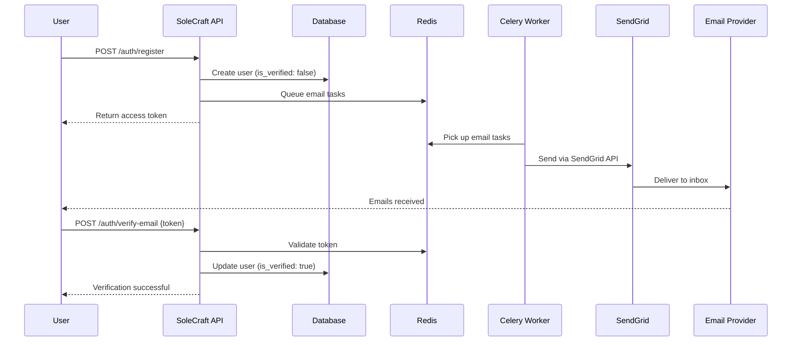

# SendGrid Email Setup Guide for SoleCraft API

This guide explains how to set up email functionality using SendGrid for the SoleCraft API.

## 📧 Email Flow in SoleCraft

When a user registers, here's what happens:

1. **User Registration** → User provides email, password, and details
2. **Account Creation** → User account is created with `is_verified: false`
3. **Welcome Email** → Immediate welcome email is sent via Celery task
4. **Verification Email** → Email with verification link is sent
5. **User Clicks Link** → User clicks verification link in email
6. **Account Verified** → User's `is_verified` flag is set to `true`

## 🚀 SendGrid Setup

### Step 1: Create SendGrid Account

1. **Sign up for SendGrid:**
   - Go to [SendGrid.com](https://sendgrid.com/)
   - Create a free account (100 emails/day free tier)
   - Verify your account via email

2. **Verify Sender Identity:**
   - Go to **Settings** → **Sender Authentication**
   - Choose **Single Sender Verification** (for development)
   - Add your email address (e.g., `noreply@yourdomain.com`)
   - Verify the email address

### Step 2: Generate API Key

1. **Create API Key:**
   - Go to **Settings** → **API Keys**
   - Click **Create API Key**
   - Choose **Restricted Access**
   - Grant **Full Access** to **Mail Send**
   - Copy the API key (save it securely!)

### Step 3: Configure Environment

Update your `.env` file:

```env
# Email Configuration (SendGrid)
SENDGRID_API_KEY=SG.your-actual-api-key-here
EMAIL_FROM=noreply@yourdomain.com
EMAIL_FROM_NAME=SoleCraft
ADMIN_EMAIL=admin@yourdomain.com
```

## 🛠️ Development vs Production

### Development Setup
```env
# Use your personal email for testing
SENDGRID_API_KEY=SG.your-dev-api-key
EMAIL_FROM=your-verified@email.com
EMAIL_FROM_NAME=SoleCraft Dev
ADMIN_EMAIL=your-email@gmail.com
```

### Production Setup
```env
# Use your domain email
SENDGRID_API_KEY=SG.your-prod-api-key
EMAIL_FROM=noreply@yourdomain.com
EMAIL_FROM_NAME=SoleCraft
ADMIN_EMAIL=support@yourdomain.com
```

## 🧪 Testing Email Functionality

### 1. Start Required Services

```bash
# Install SendGrid package
pip install sendgrid

# Start Redis (required for Celery)
docker run -d -p 6379:6379 redis:alpine

# Start Celery worker
celery -A workers.celery_app worker --loglevel=info

# Start API server
uvicorn main:app --reload
```

### 2. Test Email Endpoint

```bash
# Test email sending (development only)
curl -X POST "http://localhost:8000/auth/test-email?email=your-email@gmail.com"
```

### 3. Full Registration Flow Test

```bash
# 1. Register a new user
curl -X POST "http://localhost:8000/auth/register" \
  -H "Content-Type: application/json" \
  -d '{
    "email": "newuser@example.com",
    "password": "strongpassword123",
    "first_name": "John",
    "last_name": "Doe"
  }'

# 2. Check your email inbox for welcome and verification emails

# 3. Copy verification token from email and verify
curl -X POST "http://localhost:8000/auth/verify-email" \
  -H "Content-Type: application/json" \
  -d '{"token": "your-verification-token"}'

# 4. Resend verification if needed
curl -X POST "http://localhost:8000/auth/resend-verification" \
  -H "Content-Type: application/json" \
  -d '{"email": "newuser@example.com"}'
```

## 📊 SendGrid Features

### Email Analytics
- **Open Rates**: Track email opens
- **Click Tracking**: Monitor link clicks
- **Bounce Handling**: Automatic bounce management
- **Spam Reports**: Monitor spam complaints

### Email Templates
The system sends beautiful HTML emails with:
- **Responsive Design**: Works on all devices
- **Brand Consistent**: SoleCraft styling
- **Professional Layout**: Headers, footers, styling
- **Fallback Text**: Plain text versions included

### Email Types
1. **Welcome Email** 🎉
   - Sent immediately after registration
   - Includes getting started guide
   - Call-to-action buttons

2. **Verification Email** ✅
   - Email verification with secure token
   - 24-hour expiration
   - Clear instructions

3. **Order Confirmation** 📦
   - Detailed order information
   - Timeline expectations
   - Tracking links

4. **Password Reset** 🔐
   - Secure password reset link
   - 1-hour expiration
   - Security warnings

## 🔧 Troubleshooting

### Common Issues

1. **API Key not working:**
   - Check API key is correct
   - Ensure "Mail Send" permission is granted
   - Verify API key hasn't expired

2. **Sender not verified:**
   - Complete sender verification in SendGrid
   - Use the exact email address you verified
   - Check spam folder for verification email

3. **Emails not sending:**
   - Check Celery worker is running
   - Verify Redis connection
   - Look at Celery logs for errors

4. **Rate limits:**
   - Free tier: 100 emails/day
   - Upgrade plan if needed
   - Monitor usage in SendGrid dashboard

### Debug Commands

```bash
# Check Celery worker status
celery -A workers.celery_app inspect active

# Check Redis connection
redis-cli ping

# View SendGrid activity
# Login to SendGrid dashboard → Activity Feed

# Test SendGrid API directly
python -c "
from sendgrid import SendGridAPIClient
sg = SendGridAPIClient('your-api-key')
print('SendGrid connection OK')
"
```

## 📈 Monitoring

### SendGrid Dashboard
- **Activity Feed**: Real-time email events
- **Stats**: Delivery, opens, clicks, bounces
- **Suppressions**: Bounced/blocked emails
- **API Usage**: Track API calls

### Application Monitoring
```python
# Check email queue in Redis
redis-cli llen celery

# Monitor Celery tasks
celery -A workers.celery_app events

# Application logs
tail -f logs/app.log | grep email
```

## 🌟 Best Practices

### Security
- **Store API keys securely** (environment variables)
- **Use different keys** for dev/staging/production
- **Rotate API keys** regularly
- **Monitor for suspicious activity**

### Deliverability
- **Verify your domain** (for production)
- **Monitor bounce rates**
- **Handle unsubscribes properly**
- **Maintain good sender reputation**

### Performance
- **Use Celery for async sending**
- **Batch emails when possible**
- **Monitor rate limits**
- **Implement retry logic**

## 🎯 Email Architecture



## 🆚 SendGrid vs SMTP

| Feature | SendGrid | SMTP |
|---------|----------|------|
| **Setup** | API Key only | Host, port, credentials |
| **Reliability** | High (99.95% uptime) | Depends on provider |
| **Analytics** | Built-in dashboard | None |
| **Rate Limits** | Clearly defined | Varies by provider |
| **Deliverability** | Optimized | Manual optimization |
| **Error Handling** | Detailed responses | Limited feedback |
| **Templates** | Rich template engine | Manual HTML |

SendGrid is now configured and ready to send beautiful, reliable emails! 🎉 